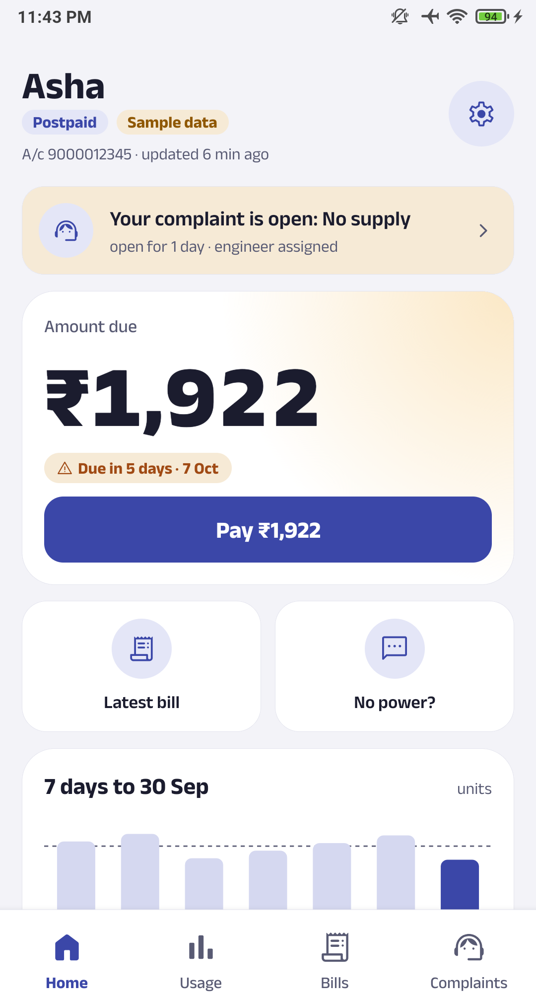
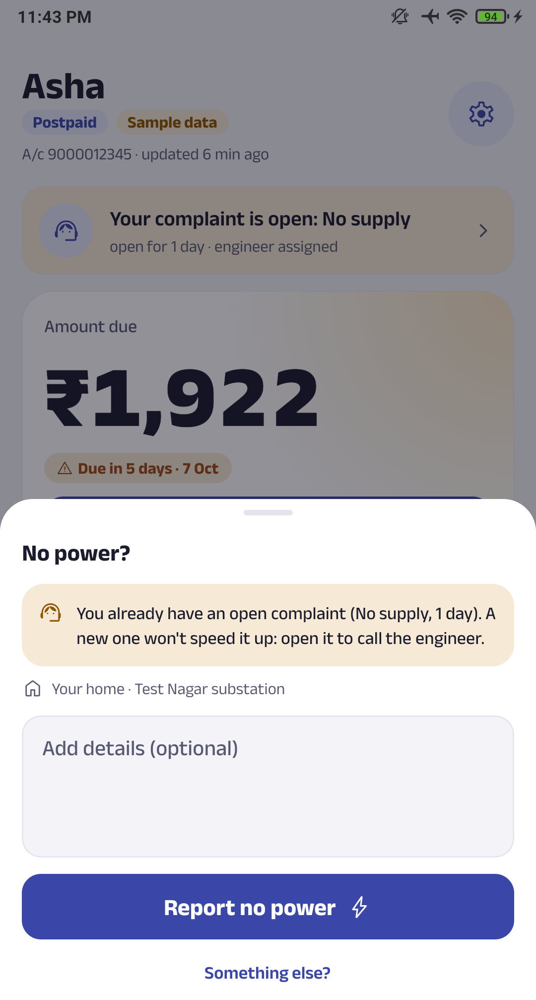
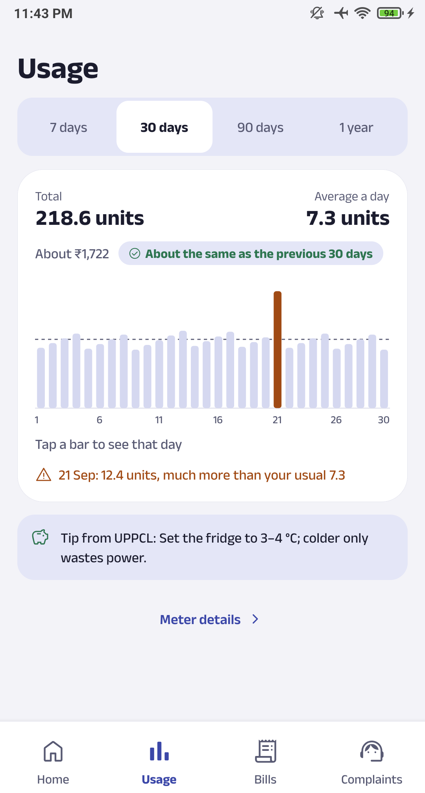
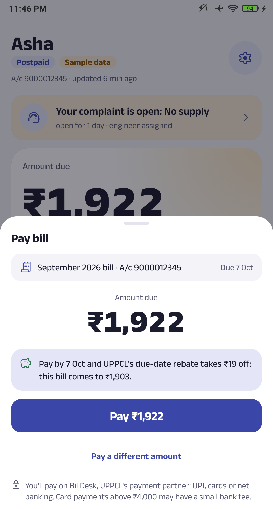
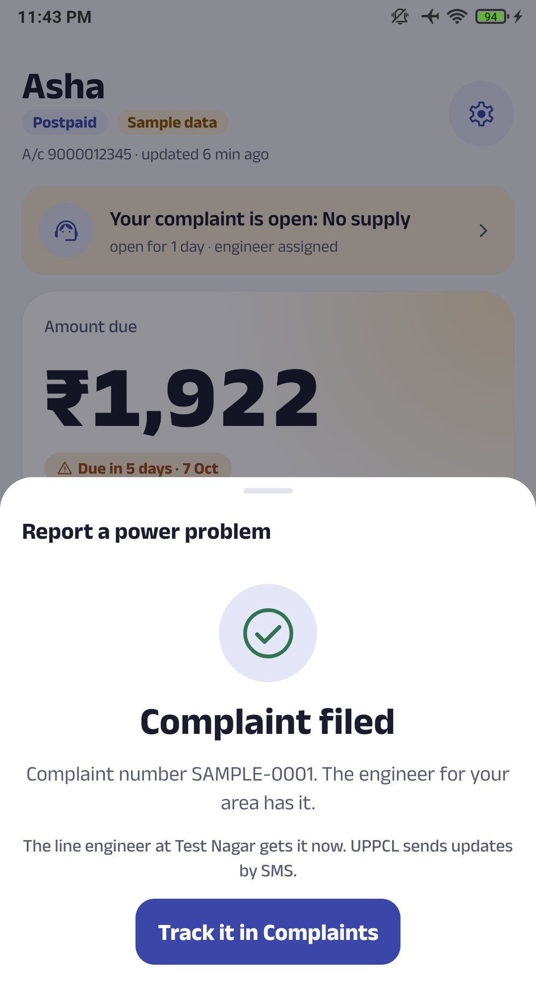
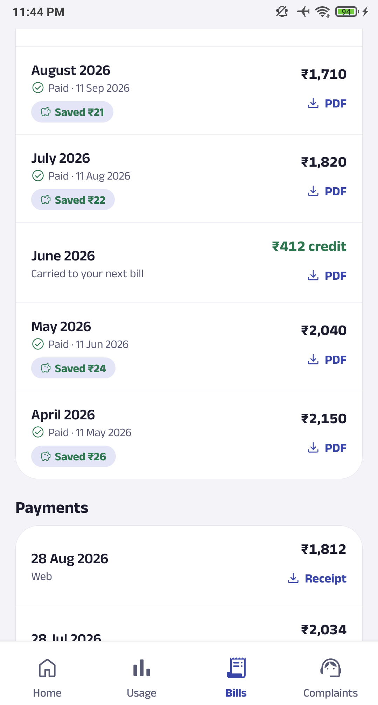

<div align="center">


# Bijli Saathi

### Your electricity, made simple. · बिजली की हर बात, आसान

The companion app for UPPCL smart meters. Your bill, your usage and your power cuts,<br>
answered on the first screen.

<br>

<a href="https://github.com/Harry-kp/uppcl-pro-app/releases/latest"></a>

<sub>Free · No ads · No tracking · Open source · English and हिन्दी</sub>

<br><br>


&nbsp;

&nbsp;


</div>

<br>

<table>
<tr>
<td width="55%" valign="middle">

## Know what you owe, before the bill does

Open the app and the answer is already there: how much is due, by when, and what you save by paying
on time. Prepaid? You see your balance and roughly how many days it will last.

Pay in a few taps through UPPCL's own payment page. Your card and UPI details never touch the app.

</td>
<td width="45%" align="center">

</td>
</tr>
<tr>
<td width="45%" align="center">

</td>
<td width="55%" valign="middle">

## Power gone? Two taps.

Tap **No power?**, then **Report no power**. Your complaint goes to UPPCL 1912 with your account,
substation and line engineer already filled in. No forms, no hold music.

Low voltage, one phase out, or a neighbour's connection are one screen away. Track every complaint
and call the engineer straight from the app.

</td>
</tr>
<tr>
<td width="55%" valign="middle">

## Is my usage normal?

Daily units, hour by hour, and the days that stood out. See which hours cost you the most and how
this month compares with the last.

Every bill and receipt is a PDF away, and the app shows what paying on time saved you, bill by bill.

</td>
<td width="45%" align="center">

</td>
</tr>
</table>

<div align="center">

<br>

**Also inside:** home-screen widget · bill and balance reminders · dark mode · हिन्दी ·
long-press shortcuts · clear messages when UPPCL itself is down

<br>


&nbsp;


<sub>Screenshots show the app's built-in sample data, never a real account.</sub>

</div>

<br>

## Private by design

**There is no server of ours.** Your phone talks to UPPCL directly, for everything. Nobody in
between sees your password, your bills or your address.

**Nothing is collected.** No analytics, no ads, no account with us. Signing out deletes everything the
app stored. The full details are in the [privacy policy](docs/privacy.md), and the code is right here to read.

## Get started

1. Download the APK from the **[latest release](https://github.com/Harry-kp/uppcl-pro-app/releases/latest)** on your phone and open it.
2. Allow installs from your browser when Android asks, then install.
3. Sign in with your UPPCL SMART account, or tap **Try with sample data** to look around first.

No UPPCL SMART account yet? [Create one here](https://uppcl.sem.jio.com/uppclsmart/signup). New versions
show up inside the app; install over the old one and you stay signed in.

<details>
<summary>Make sure it's the real app</summary>

<br>

Every official APK is signed with this key (SHA-256 certificate fingerprint):

```
42:5E:6D:CC:C8:67:2D:27:CD:F7:28:F7:BE:24:86:60:AD:D6:17:CC:39:5E:F8:59:C9:13:95:D7:FF:22:C5:CC
```

Check a download with `apksigner verify --print-certs bijli-saathi-vX.Y.Z.apk`. Android refuses to update
this app with one signed by a different key.
</details>

<details>
<summary>iPhone</summary>

<br>

An early, unsigned build comes with each release (`-unsigned.ipa` to sideload with Sideloadly or AltStore,
`-simulator.zip` for Xcode). Proper iPhone support is on the way.
</details>

## Questions

**Is it safe to type my UPPCL password here?**
It goes from your phone to UPPCL and nowhere else. Install only APKs signed with the key above.

**My bill or meter reading looks wrong.**
The app shows UPPCL's own data and can't change it. Call 1912 or use UPPCL's
[consumer portal](https://consumer.uppcl.org/wss/).

**The app says UPPCL is down.**
It often is, and the app tells you whose side failed. Try again a little later.

**Something in the app broke.**
Settings → About → Report a problem.

<br>

<div align="center">

<sub>

**Unofficial.** Bijli Saathi is an independent open-source app. It is not made by or connected to UPPCL, its
discoms (PVVNL, MVVNL, DVVNL, PuVVNL, KESCo) or Jio, and works with UPPCL SMART (smart meter) accounts only.

[Contributing and building from source](CONTRIBUTING.md) · [Security](SECURITY.md) · [How UPPCL's APIs work](docs/api-reverse-engineering.md) · [MIT License](LICENSE) © 2026 Harshit Chaudhary

</sub>

</div>
