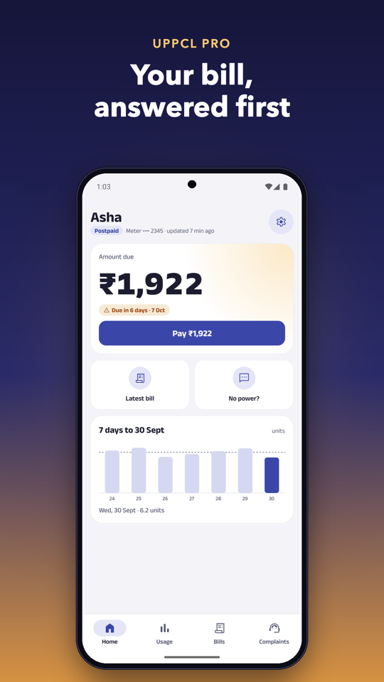
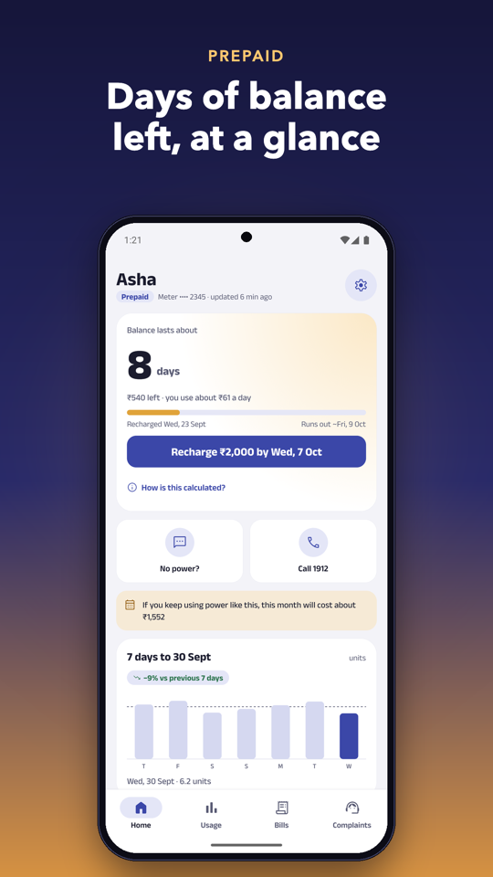
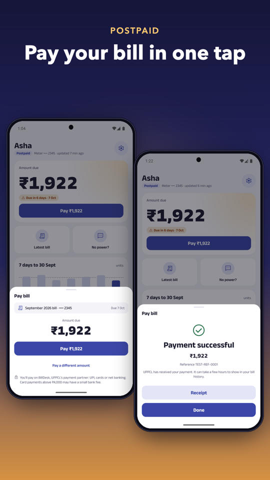
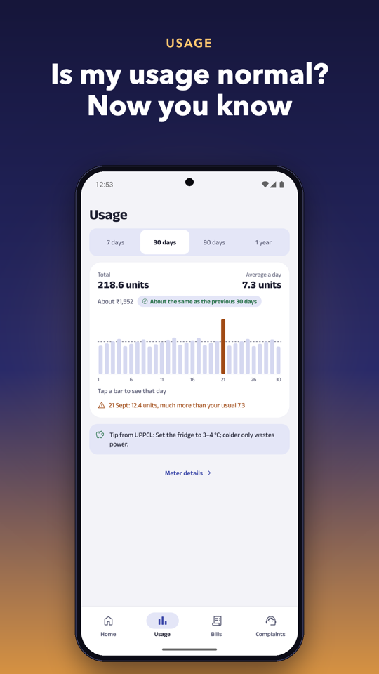
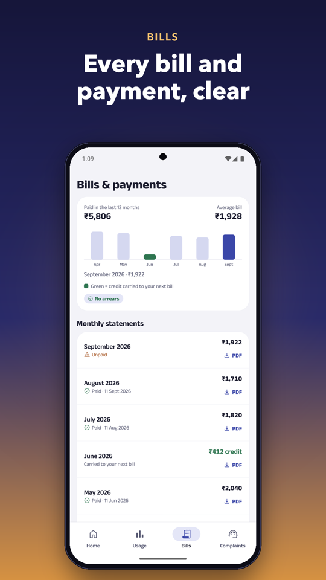
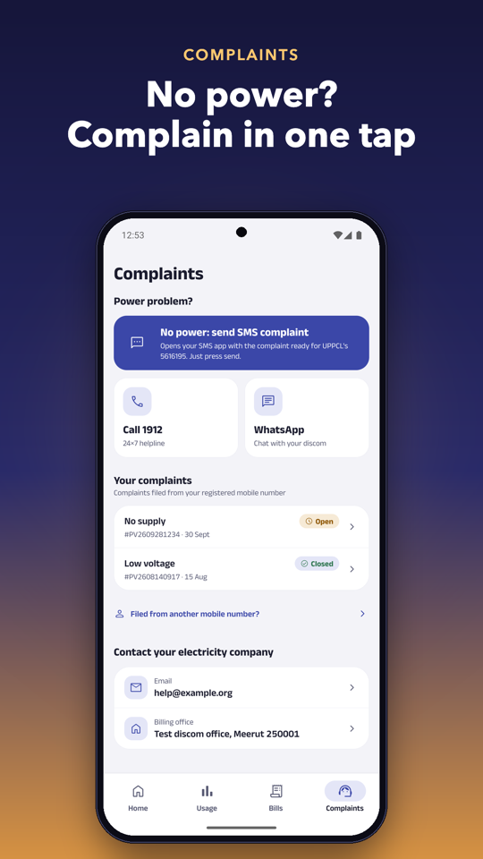
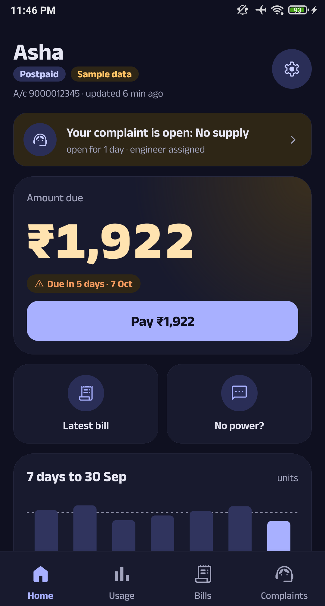
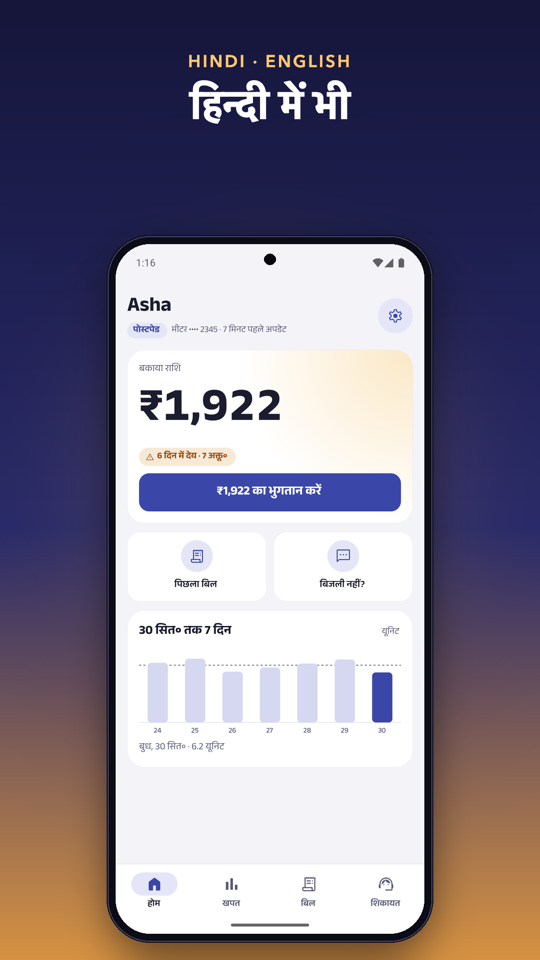

<div align="center">


# UPPCL Pro

**Your electricity, made simple.** · बिजली की हर बात, आसान

The UPPCL smart-meter app that answers the question you actually opened it for:<br>
*how long will my balance last, and what will this month's bill be?*

<a href="https://github.com/Harry-kp/uppcl-pro-app/releases/latest"></a>

<a href="https://github.com/Harry-kp/uppcl-pro-app/releases/latest"></a> <a href="LICENSE"></a>

Free · no ads · no tracking · open source · हिन्दी + English

<br>






</div>

> [!NOTE]
> **Unofficial.** UPPCL Pro is an independent open-source app, not made by or connected to UPPCL, its
> discoms (PVVNL, MVVNL, DVVNL, PuVVNL, KESCo) or Jio. It uses UPPCL's own public systems through
> [reverse-engineered APIs](docs/), which can change or break at any time.

## Why people use it

<table>
<tr>
<td width="50%" valign="top">

⏳ **"Balance lasts about 8 days"**

Prepaid: when it runs out, and how much to recharge so you're covered for ~40 days.

</td>
<td width="50%" valign="top">

🧾 **Your bill before it arrives**

Postpaid: amount due and due date, or an estimate of the bill that's coming, with the assumption spelled out.

</td>
</tr>
<tr>
<td width="50%" valign="top">

💸 **Pay without the portal maze**

UPPCL's own payment flow through BillDesk, in a bottom sheet. Card and UPI details never touch the app.

</td>
<td width="50%" valign="top">

📊 **"Is my usage normal?"**

Daily units, month by month, and the days that stood out against your usual.

</td>
</tr>
<tr>
<td width="50%" valign="top">

⚡ **No power? One tap.**

Opens your SMS app with UPPCL's complaint message already written for your account. Or call 1912.

</td>
<td width="50%" valign="top">

🔔 **Alerts you choose**

Low balance, new bill, due soon, planned power cuts, a monthly budget. All off until you turn them on.

</td>
</tr>
</table>

**Also in the box:** bill and receipt PDFs inside the app · 1912 complaint status and the officer assigned ·
home-screen widget · long-press shortcuts (no-power SMS, latest bill, pay) · light and dark mode · an in-app
update check · errors that say **whose side failed** (UPPCL SMART, the bill portal, the 1912 portal, or the app).

<div align="center">




<br><sub>Screenshots use invented test data, never a real account.</sub>
</div>

## Get it

**You need a UPPCL SMART login** (the same one as UPPCL's official UPPCL SMART app). No account yet?
[Sign up on UPPCL SMART](https://uppcl.sem.jio.com/uppclsmart/signup) first; the app's sign-in screen links
there too, and to forgot username / password.

1. On your phone, open the **[latest release](https://github.com/Harry-kp/uppcl-pro-app/releases/latest)**
   and download `uppcl-pro-vX.Y.Z.apk`.
2. Open it. Android asks to allow installs from your browser or Files app: allow, then install.
3. That's it. When a newer version is out, the app tells you; install it over the old one and you stay signed in.

<details>
<summary><b>Check it's really this app</b> (signing key)</summary>

<br>

Every official APK is signed with this key (SHA-256 certificate fingerprint):

```
42:5E:6D:CC:C8:67:2D:27:CD:F7:28:F7:BE:24:86:60:AD:D6:17:CC:39:5E:F8:59:C9:13:95:D7:FF:22:C5:CC
```

Android refuses to install an update signed with a different key over this one. If a site offers
"UPPCL Pro" signed differently, it isn't this app. Check a download yourself with
`apksigner verify --print-certs uppcl-pro-vX.Y.Z.apk`. Each release also lists the APK's SHA-256 checksum.
</details>

**iPhone:** an early, unsigned build is attached to each release (`-unsigned.ipa` for sideloading with
Sideloadly or AltStore, `-simulator.zip` for Xcode's simulator). It isn't polished for iOS yet; proper
iPhone support is on the way.

## Your data stays with you

- **No UPPCL Pro server.** Your phone talks straight to UPPCL. Nobody in between sees your password.
- **Nothing leaves your phone except to UPPCL.** No analytics, no ads, no account with us.
- **Signing out wipes it.** Session, saved screens and (if you turned alerts on) your saved password.

<details>
<summary><b>Exactly what goes where</b></summary>

<br>

- The app calls **UPPCL SMART** (`uppcl.sem.jio.com`, the smart-meter system) and UPPCL's **consumer portal**
  (`consumer.uppcl.org`: bills, PDFs, payment) directly from your phone.
- You sign in with your UPPCL SMART username and password. The session is kept on your phone in an
  encrypted file (AES-GCM) whose key lives in the Android keystore.
- **One exception: complaint status.** The 1912 portal needs cookie handling a phone app can't do, so that
  lookup goes through a small stateless route of the companion web project
  [uppcl-pro](https://github.com/Harry-kp/uppcl-pro) (`https://uppcl-pro.vercel.app/api/complaints`). It gets
  your registered mobile number (no password, no token), forwards it to the 1912 portal, and stores and logs
  nothing. If it's down, only complaint status is affected.
- **Alerts** (off by default) have to sign in again in the background when your session expires. If you turn
  them on, your UPPCL username and password are stored encrypted in the Android keystore, on your phone
  only, and removed when you turn alerts off or sign out. The checks run on the phone.
- The update check asks `api.github.com` for the latest release (no account data). "Report a problem" only
  opens GitHub (in your browser, or inside the app if the phone has no browser); nothing is sent until you
  submit, and issues are public, so remove anything personal first.
- How UPPCL's APIs work: [docs/api-reverse-engineering.md](docs/api-reverse-engineering.md),
  [docs/payment-reverse-engineering.md](docs/payment-reverse-engineering.md).
</details>

## Good to know

- **UPPCL goes down a lot.** When it does, the app says so, and that it's their side (for example
  `CCB_ISE_SE_503` means UPPCL's billing backend is down). Try again later.
- **"Days left" and bill estimates are predictions** from your recent usage, not UPPCL's figures.
- **In-app payment is new.** Check the receipt, and use the official UPPCL site if anything looks off.
- **Smart meters only** (accounts on UPPCL SMART). The 1912 complaint portal is slow and often times out.

<details>
<summary><b>FAQ</b></summary>

<br>

**Is it safe to type my UPPCL password here?**
It goes from your phone to UPPCL and nowhere else, and the code that does it is right here to read
(`shared/api.ts`). Only install APKs signed with the key above.

**Why isn't it on the Play Store?**
It's an unofficial app for someone else's service; releases on GitHub keep it simple and free. The app checks
for updates itself.

**My bill, meter or recharge is wrong.**
That's UPPCL's side: call 1912 or use UPPCL's [consumer portal](https://consumer.uppcl.org/wss/). This app
shows UPPCL's data, it can't change your account.

**Something broke in the app.**
Settings → About → **Report a problem**. On an error, **Details → Copy details** gives the text that
tells us whose side failed.
</details>

## Contributing

Bug reports and small, focused PRs are welcome; see [CONTRIBUTING.md](CONTRIBUTING.md) and, for security
issues, [SECURITY.md](SECURITY.md).

<details>
<summary><b>Build from source</b></summary>

<br>

Needs [Bun](https://bun.sh), and for a device build the Android SDK and JDK 17.

```sh
bun install
bun run typecheck
bun test
bunx expo run:android          # debug build on a device or emulator
```

Release APK (what CI does): `bunx expo prebuild --platform android`, then
`cd android && ./gradlew assembleRelease` with a signing config; see
[.github/workflows/release.yml](.github/workflows/release.yml). Dev builds include fake-data test scenarios
(Settings → Developer) for screens a real account can't reach; they live in `src/dev` and are removable with
`scripts/remove-dev-tools.sh`.
</details>

## License

[MIT](LICENSE) © 2026 Harshit Chaudhary
